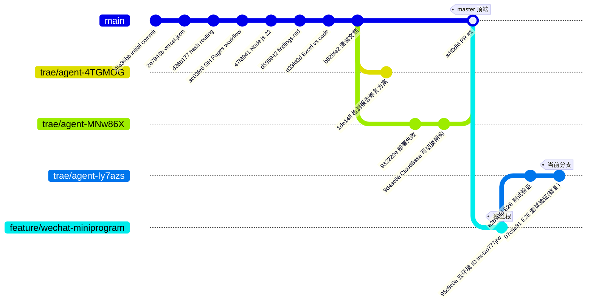

# 线上分支派生关系

> 仓库：[728450574/candito-training-app](https://github.com/728450574/candito-training-app)
> 更新时间：2026-07-13

## 分支派生图

## 分支清单

| 分支 | 顶端提交 | 派生自 | 状态 |
|------|----------|--------|------|
| `master` | `a4f0df6` | `4fe36bb`（initial commit） | 主分支，已合入 PR #1 |
| `trae/agent-4TGMOG` | `1de14ff` | `b82bfe2`（master 早期提交） | 未合回，停留在 "检测报告修复方案" |
| `trae/agent-MNw86X` | `9d4ac6a` | `b82bfe2`（同上） | 已通过 PR #1 合入 master |
| `feature/wechat-miniprogram` | `95c8c0a` | 无（独立根） | 仅含云环境配置提交 |
| `trae/agent-Iy7azs` | `07c5e81` | `95c8c0a`（feature/wechat-miniprogram 顶端） | **当前分支**，含 E2E 测试验证 |

## 关键说明

### 两条独立根链
- **master 链**：以 `4fe36bb initial commit` 为根，H5 工程历史
- **feature/wechat-miniprogram 链**：以 `95c8c0a 云环境 ID` 为根，与 master 无共同祖先，小程序工程全新初始化

### 派生路径
1. `trae/agent-4TGMOG` 从 master 的 `b82bfe2` 派生 → 停留在 `1de14ff`，未合回
2. `trae/agent-MNw86X` 从 master 的 `b82bfe2` 派生 → 通过 **PR #1** 合入 master（merge commit `a4f0df6`）
3. `trae/agent-Iy7azs`（当前分支）从 `feature/wechat-miniprogram` 的 `95c8c0a` 派生 → 新增 2 个 E2E 测试提交

### 合并注意事项
由于 `feature/wechat-miniprogram` 与 master 无共同祖先，将 `trae/agent-Iy7azs` 合入 master 时需使用 `--allow-unrelated-histories`，否则 git 会拒绝合并。
